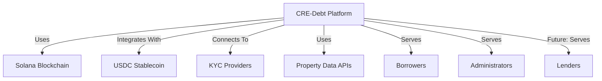
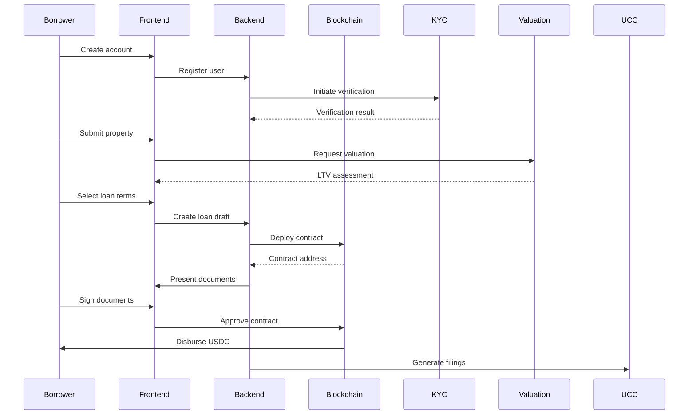

# CRE-Debt-Solana: Technical Architecture

## System Overview

The CRE-Debt-Solana platform consists of several integrated components working together to enable commercial real estate owners to access equity through blockchain-based debt instruments.

## System Context Diagram

## Core Components

### 1. Smart Contract System

The platform's backbone consists of Solana-based smart contracts written in Rust using the Anchor framework. These contracts handle:

#### Loan Origination Contract
- Manages the creation of new loans
- Handles collateral validation
- Enforces LTV ratio limits
- Manages loan terms (duration, interest rate, payment schedule)
- Ensures proper KYC/AML verification before approval

#### Loan Servicing Contract
- Tracks and processes loan repayments
- Handles interest calculations
- Manages late payments and penalties
- Triggers default procedures when necessary

#### Stablecoin Integration
- Interfaces with USDC for loan disbursements and repayments
- Manages escrow functionality for funds
- Handles treasury operations for platform fees

#### Lender Marketplace (Future Phase)
- Manages lender participation and commitments
- Handles loan syndication and participation
- Implements risk tranching for institutional lenders

### 2. Backend Services

A set of off-chain services that support the blockchain functionality:

#### Property Valuation Service
- Integrates with third-party data providers for CRE valuations
- Implements AI algorithms for property value assessment
- Calculates appropriate LTV ratios based on property characteristics
- Monitors market conditions for ongoing valuation updates

#### KYC/AML Service
- Verifies borrower identity and credentials
- Performs sanctions screening
- Implements risk-based compliance procedures
- Maintains compliance records for regulatory requirements

#### Document Generation System
- Creates UCC filing documentation
- Generates loan agreements and term sheets
- Produces borrower disclosure documents
- Creates legal backup documentation for smart contracts

#### Analytics Engine
- Tracks platform metrics and performance
- Monitors loan performance and risk metrics
- Provides reporting for regulatory compliance
- Offers insights for product improvement

### 3. User Interfaces

#### Borrower Portal
- Account creation and management
- Property submission and valuation
- Loan application process
- Document uploads for verification
- Loan management and repayment dashboard
- Stablecoin wallet integration

#### Admin Dashboard
- Loan approval workflow
- Risk management tools
- Compliance monitoring
- System health monitoring
- Analytics and reporting

#### Lender Portal (Future Phase)
- Investment opportunities listing
- Commitment management
- Portfolio performance tracking
- Risk assessment tools

## Data Flows

### Loan Origination Process

### Loan Servicing Process
1. Smart contract tracks loan payment schedule
2. Borrower receives notifications for upcoming payments
3. Borrower sends USDC payments to contract address
4. Contract processes payment, updates loan status
5. Platform fees are extracted and distributed
6. Late payment triggers are monitored and activated if needed
7. Loan performance data is recorded for analytics

### Default Handling Process
1. Smart contract identifies missed payments beyond grace period
2. Automated notifications are sent to borrower
3. Default procedures are initiated per loan agreement
4. Legal documentation is generated for enforcement
5. Workout options are presented when applicable
6. UCC foreclosure process is initiated if necessary

## Technical Stack

### Blockchain Layer
- **Network**: Solana Mainnet
- **Smart Contract Framework**: Anchor
- **Programming Language**: Rust
- **Token Standard**: SPL Tokens
- **Oracle Integration**: Pyth Network for price feeds

### Backend Services
- **Server Framework**: Node.js with TypeScript
- **API Layer**: GraphQL
- **Database**: PostgreSQL for relational data, MongoDB for documents
- **Valuation Engine**: Python with ML libraries
- **Document Processing**: AWS Textract, DocuSign integration
- **Queue System**: RabbitMQ
- **File Storage**: IPFS for decentralized storage, AWS S3 for backups

### Frontend Layer
- **Framework**: React with TypeScript
- **State Management**: Redux
- **Wallet Integration**: Phantom, Solflare
- **UI Component Library**: Material UI
- **Data Visualization**: D3.js
- **Maps Integration**: Google Maps API

### DevOps & Infrastructure
- **CI/CD**: GitHub Actions
- **Containerization**: Docker
- **Cloud Provider**: AWS
- **Monitoring**: Grafana, Prometheus
- **Logging**: ELK Stack

## Security Considerations

### Smart Contract Security
- Formal verification of critical contract logic
- Comprehensive security audits before deployment
- Rate limiting to prevent flash loan attacks
- Emergency pause functionality
- Upgradable contract architecture with timelock

### Data Security
- End-to-end encryption for sensitive documents
- Private data stored off-chain with secure references
- Role-based access control for all system components
- Regular penetration testing and security audits
- Compliance with financial data security standards

### Operational Security
- Multi-signature requirements for critical operations
- Secure key management with hardware security modules
- Regular backup and disaster recovery procedures
- Air-gapped deployment for critical signing operations
- Bug bounty program for vulnerability discovery

## Integration Points

### External Services
- Property valuation data providers
- KYC/AML verification services
- UCC filing systems
- Banking system connectors for fiat on/off ramps
- Credit analysis APIs

### Blockchain Integrations
- USDC contract interfaces
- Solana program interfaces
- Cross-chain bridges (future)
- DeFi protocol integrations (future)

## Scalability Considerations

### Technical Scalability
- Horizontal scaling of backend services
- Database sharding for performance
- Caching layers for frequently accessed data
- Optimized smart contract design to minimize resource usage
- Batched processing for high-volume operations

### Business Scalability
- Multi-jurisdiction support (starting with Wyoming/Texas)
- Extensible framework for different property types
- API-first design for future integrations
- Modular architecture for feature expansion
- Integration hooks for traditional finance systems

## Regulatory Compliance Design

### KYC/AML Implementation
- Identity verification workflow
- Risk-based approach to customer due diligence
- Ongoing monitoring for suspicious activities
- Compliance reporting capabilities
- Audit trails for all verification steps

### UCC Filing Automation
- Template generation for UCC-1 forms
- Integration with electronic filing systems
- Status tracking and renewal management
- Amendment processing for loan modifications
- Filing verification and confirmation

### Smart Contract Legal Wrappers
- On-chain hash references to legal documents
- Dual enforcement mechanism design
- Jurisdiction selection functionality
- Force majeure handling
- Dispute resolution procedures

## Current Development Status

### ✅ Completed Components

#### Property Registry Smart Contract
- **Status:** ✅ Fully Implemented
- **Features:**
  - Property registration with metadata
  - Property value updates
  - Platform-controlled verification
  - PDA-based account management
  - Comprehensive error handling

#### Project Infrastructure
- **Status:** ✅ Complete
- **Components:**
  - Docker development environment
  - Comprehensive documentation
  - Development scripts and utilities
  - Project structure and organization

### 🔄 In Progress: Production Sprint (Week 1 of 4)

#### Loan Core Smart Contract
- **Status:** 🔄 In Development
- **Planned Features:**
  - Loan creation and origination
  - Loan approval workflow
  - USDC funding mechanism
  - Payment processing
  - Loan lifecycle management

#### Borrower Registry Smart Contract
- **Status:** 📋 Planned for Week 1
- **Planned Features:**
  - Borrower registration
  - KYC status management
  - Borrower-loan linking

### 📋 Upcoming Components

#### Backend API (Week 2)
- **Status:** 📋 Planned
- **Components:**
  - PostgreSQL database integration
  - RESTful API endpoints
  - Smart contract integration layer
  - Authentication and security

#### Frontend Application (Week 3)
- **Status:** 📋 Planned
- **Components:**
  - React application with TypeScript
  - Wallet integration (Phantom/Solflare)
  - Loan application workflow
  - Borrower dashboard
  - Payment interface

#### Integration & Demo (Week 4)
- **Status:** 📋 Planned
- **Components:**
  - End-to-end testing
  - Demo preparation
  - VC pitch materials
  - Production deployment

## MVP Success Criteria

**Go/No-Go Requirements:**
- [x] Property registration and verification system
- [ ] Complete loan origination flow (application → approval → funding)
- [ ] USDC loan disbursements
- [ ] Functional borrower dashboard
- [ ] End-to-end demo scenario
- [ ] Production deployment readiness

## Technical Debt & Future Considerations

### Immediate Priorities (Post-MVP)
- Comprehensive smart contract testing
- Security audit and formal verification
- Performance optimization
- Enhanced error handling

### Future Enhancements
- Institutional lender marketplace
- Advanced property valuation engine
- Cross-chain integration
- Mobile application
- Advanced analytics and reporting
